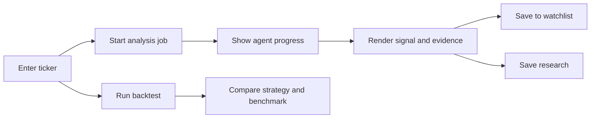

<div align="center">

# StockPilot

### Verifiable AI-assisted stock research, designed for clarity

[](https://nextjs.org/)
[](https://react.dev/)
[](https://www.typescriptlang.org/)
[](https://stockpilot-analyzer.vercel.app)
[](#product-experience)

[**Open live application**](https://stockpilot-analyzer.vercel.app) | [**View API documentation**](https://finance-stock-analyzer.onrender.com/docs) | [**Backend repository**](https://github.com/mayank2OP/finance-stock-analyzer)

</div>

StockPilot turns quantitative stock analysis into a clear research experience without hiding the evidence. Users can inspect every indicator, rule contribution, source, and backtest assumption. AI agents review supplied evidence; they do not generate market values or override the rules-based result.

## Visual product tour

### Welcome experience

The product opens with a concise explanation of its trust model and a distraction-free authentication flow.

<p align="center">
  
</p>

### Evidence-first research workspace

The dashboard keeps the primary decision easy to understand while technical metrics, calculation proof, and source information remain available for inspection.

<p align="center">
  
</p>

### Transparent backend contract

The frontend is backed by a documented FastAPI service rather than hidden mock data. Recruiters and developers can inspect every production endpoint.

<p align="center">
  
</p>

| Explainable analysis | Auditable backtests | Personal workspace | Production deployment |
|:---:|:---:|:---:|:---:|
| Metrics, proof, sources | Strategy vs benchmark | Watchlist and history | Vercel + Render + Neon |

## Learning handbooks

Use the illustrated guides to understand the complete system or prepare for interviews.

| Guide | Download |
|---|---|
| Frontend learning and interview handbook | [Open PDF](https://github.com/mayank2OP/finance-stock-analyzer/blob/main/output/pdf/stockpilot-frontend-learning-handbook.pdf) |
| Backend learning and interview handbook | [Open PDF](https://github.com/mayank2OP/finance-stock-analyzer/blob/main/output/pdf/stockpilot-backend-learning-handbook.pdf) |

## Product experience

- Secure account registration and JWT sign-in
- Guided ticker analysis with asynchronous progress
- Plain-English action, risk, strengths, and warnings
- Evidence-quality indicator with an honest definition
- Market metrics and expandable calculation proof
- Clickable, attributable news sources
- Strategy-versus-buy-and-hold backtesting
- Personal watchlist and saved research history
- Responsive layouts for desktop and mobile
- Clear loading, empty, success, and error states

## Application flow



## Technology stack

| Technology | Purpose |
|---|---|
| Next.js 16 | Production React framework and Vercel build target |
| React 19 | Component-driven user interface |
| TypeScript | Compile-time safety for API contracts and UI state |
| CSS | Responsive StockPilot design system and motion |
| Vercel | Continuous deployment and public hosting |
| FastAPI backend | Authentication, analysis, backtesting, and persistence |

## Run locally

### Prerequisites

- Node.js 22.13+
- The [StockPilot backend](https://github.com/mayank2OP/finance-stock-analyzer) running locally

```powershell
git clone https://github.com/mayank2OP/finance-stock-analyzer-frontend.git
cd finance-stock-analyzer-frontend
npm install
Copy-Item .env.example .env.local
npm run dev
```

The default configuration connects to `http://127.0.0.1:8000`. Open `http://localhost:3000`.

To use another backend, set:

```env
NEXT_PUBLIC_API_URL=https://your-backend.example.com
```

This value is public by design because it contains only the API address. Never place Gemini keys, JWT secrets, database credentials, or user access tokens in frontend environment variables.

## Validate

```powershell
npm run lint
npm test
```

`npm test` runs linting and a production Next.js build, catching both code-quality and deployment errors.

## Deploy on Vercel

1. Import this GitHub repository into Vercel.
2. Select the **Next.js** framework preset.
3. Keep the root and output directories at their defaults.
4. Add the production environment variable:

   ```env
   NEXT_PUBLIC_API_URL=https://finance-stock-analyzer.onrender.com
   ```

5. Deploy the project.
6. Add the final Vercel origin to the backend's `CORS_ORIGINS` value and redeploy the backend.

Current production origin:

```env
CORS_ORIGINS=https://stockpilot-analyzer.vercel.app
```

## Security notes

- Authentication tokens are sent only to the configured backend.
- No private API or database secrets are included in the browser bundle.
- Protected data is requested per authenticated user.
- Financial outputs include their evidence and informational-use disclaimer.

## Disclaimer

StockPilot is an educational research project. It does not provide personalized financial advice, and its signals or backtests should not be treated as recommendations or guarantees.

## Author

Built by [Mayank Rawat](https://github.com/mayank2OP).
